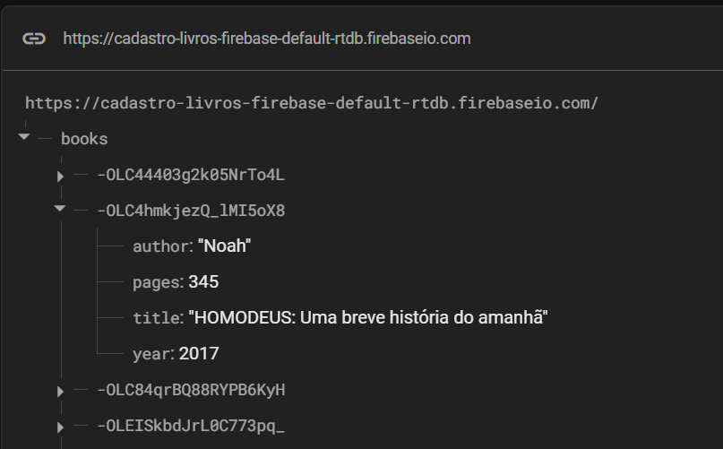
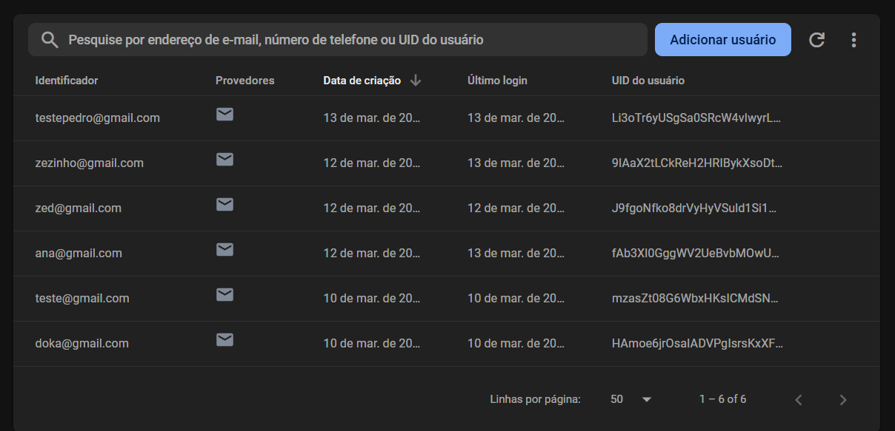

# cadastro-livros-firebase

## Sobre o projeto

O projeto tem como objetivo implementar um sistema de cadastro de livros da biblioteca utilizando Python com interface gráfica (GUI) e armazenamento no Firebase.

### 📋 Requisitos Funcionais:

O sistema deve permitir as operações CRUD nos seguintes campos:
- Título do livro
- Autor principal
- Quantidade de páginas
- Ano de publicação

### ⚙ Requisitos Técnicos:

- A interface gráfica deve ser implementada com (Tkinter ou PyQt).
- O Firebase deve ser utilizado tanto para armazenamento dos livros quanto para autenticação do usuário.
- A autenticação pode ser feita via email/senha.
- O banco de dados pode ser Firestore ou Realtime Database.
- Implementar mensagens de erro/sucesso para operações do CRUD.
- As operações CRUD devem refletir as alterações no Firebase e ser demonstradas na apresentação do projeto.

### Clonando e acessando o repositório
```bash
git clone https://github.com/MarcosAndreLS/cadastro-livros-firebase.git
cd cadastro-livros-firebase
```

### Instalando as dependências
```bash
pip install -r requirements.txt
```

### Estrutura do projeto

```bash
cadastro-livros-firebase/
    |
    |--- docs/
    |    |--- README.md # documentação do projeto
    |
    |--- src/
    |    |
    |    |--- controllers/
    |    |   |--- library_controller.py # 
    |    |   |--- login_user_controller.py
    |    |   |--- signup_user_controller.py
    |    |
    |    |--- database/
    |    |   |--- auth.py # responsável pela autenticação
    |    |   |--- crud.py # responsável por fazer o CRUD           
    |    |   |--- firebase_config.py # credenciais do firebase
    |    |
    |    |--- gui/ # interfaces gráficas
    |        |--- ui/
    |        |
    |        |--- library.py
    |        |--- login_window.py
    |        |--- main_window.py
    |        |--- search_books_window.py
    |        |--- sign_up_books_window.py
    |        |--- sign_up_window.py
    |--- main.py
    |--- requirements.txt
```

### Executando a aplicação

```bash
python main.py
```

### Tecnologias utilizadas

- `Firebase`
    - `Realtime Database`
    - `Authentication`
- `PyQt5`

#### Realtime Database



#### Authentication



### Prints da interface


A tela principal contém opções de saída da aplicação, login de usuário e cadastro de usuário. 


A tela de login possui campos de inserção de dados como email e senha. E os botões para logar e voltar para tela principal. O seguintes "Messages Box" podem ser mostrados na tela de login.

- Caso não haja informações nos campos, será mostrado um "Message Box" pedindo para preencher o campo email.
- Caso não haja informação no campo ed senha, será mostrado um "Message Box" pedindo para preencher o campo senha.
- Caso seja inserido o email e senha corretos, será mostrado a tela principal da biblioteca com o "Message Box" de login bem sucedido.


```
 
```


A tela de cadastro contém opções de voltar para tela principal e finalizar o cadastro. Além disso, ela possui campos de inserção de dados como email, senha e confirmação de senha. O seguintes "Messages Box" podem ser mostrados na tela de cadastro.

- Caso não haja informações nos campos, será mostrado um "Message Box" pedindo para preencher o campo email.
- Caso não haja informação no campo de senha, será mostrado um "Message Box" pedindo para preencher o campo senha.
- Caso seja inserido um email com uma senha abaixo de 6 caracteres, será mostrado um "Message Box" infromando que a senha é fraca e é necessário pelo menos 6 caractes.
- Caso o email já esteja cadastrado, será mostrado um "Message Box" informando que o email já foi cadastrado.
- Caso seja inserido senhas diferentes, será mostrado um "Message Box" informando que as senhas são diferentes.


```
```


A tela principal da biblioteca contém as opções de voltar para tela inicial, cadastrar livro e pesquisar os livros.


A tela de cadastro de livro contém os campos de título do livro, nome do autor, quantidade de páginas e ano de publicação. Além disso, existe o botão de cadastro de livro e o botão de voltar. O seguintes "Messages Box" podem ser mostrados na tela de cadastro do livro.

- Caso não haja informações nos campos, será mostrado um "Message Box" pedindo para preencher todos os campos. Isso serve para todas as outras condições de campo preenchido.
- Caso haja um livro cadastrado com as mesmas informações de outro, será mostrado um "Message Box" informando que o livro já foi cadastrado.
- Caso o livro seja cadastrado com sucesso, será mostrado um "Message Box" informando que o livro foi cadastrado com sucesso.


```
```


A tela de pesquisar os livros, mostra todos os livros cadastrados juntamente com as opções de editar e excluir o livro correspondente. Além disso, existem campos de pesquisa, caso seja inserido algum dado, será pesquisado e retornado o resultado após apertar o botão de buscar.

- Caso queira excluir o livro, será mostrado um "Message Box" com as opções de sim e não. Caso seja escolhido a opção sim, o livro será excluído. Após isso, será mostrado um "Message Box" informando que o livro foi excluído com sucesso.


